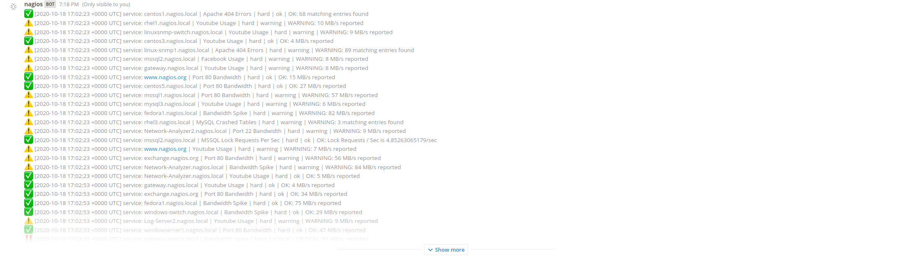
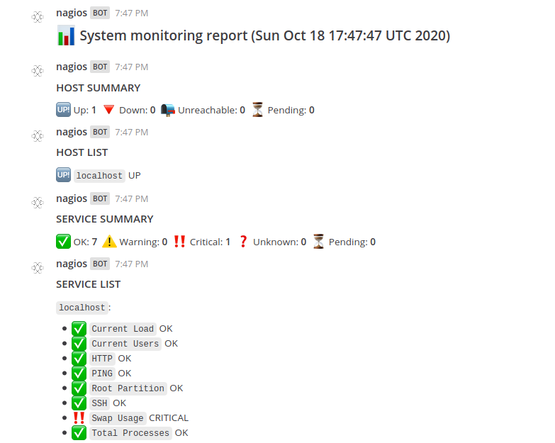
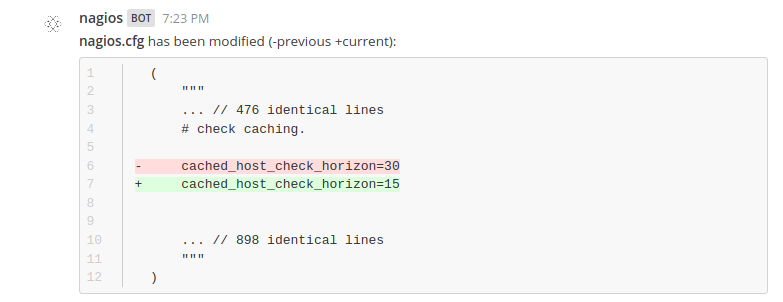

# Mattermost Nagios Plugin 

**Maintainers**: [@amwolff](https://github.com/amwolff) & [@DanielSz50](https://github.com/DanielSz50)

A Nagios plugin for Mattermost. Supports Nagios Core >= 4.4.x.

## Table of contents

- [About](https://github.com/ulumuri/mattermost-plugin-nagios#about)
    - [Screenshots](https://github.com/ulumuri/mattermost-plugin-nagios#screenshots)
        - [Getting logs](https://github.com/ulumuri/mattermost-plugin-nagios#getting-logs)
        - [Receiving system monitoring reports](https://github.com/ulumuri/mattermost-plugin-nagios#receiving-system-monitoring-reports)
        - [Receiving notifications about changes to the configuration](https://github.com/ulumuri/mattermost-plugin-nagios#receiving-notifications-about-changes-to-the-configuration)
    - [Audience](https://github.com/ulumuri/mattermost-plugin-nagios#audience)
    - [Important notice](https://github.com/ulumuri/mattermost-plugin-nagios#important-notice)
- [Installing the plugin](https://github.com/ulumuri/mattermost-plugin-nagios#installing-the-plugin)
- [Configuring the plugin](https://github.com/ulumuri/mattermost-plugin-nagios#configuring-the-plugin)
    - [Configuring the configuration files watcher](https://github.com/ulumuri/mattermost-plugin-nagios#configuring-the-configuration-files-watcher)
        - [Running the watcher as a systemd service](https://github.com/ulumuri/mattermost-plugin-nagios#running-the-watcher-as-a-systemd-service)
            - [Preparing the systemd service unit file](https://github.com/ulumuri/mattermost-plugin-nagios#preparing-the-systemd-service-unit-file)
            - [Starting the watcher](https://github.com/ulumuri/mattermost-plugin-nagios#starting-the-watcher)
- [Updating the plugin](https://github.com/ulumuri/mattermost-plugin-nagios#updating-the-plugin)
- [Using the plugin](https://github.com/ulumuri/mattermost-plugin-nagios#using-the-plugin)
    - [Slash commands overview](https://github.com/ulumuri/mattermost-plugin-nagios#slash-commands-overview)
    - [Slash commands documentation](https://github.com/ulumuri/mattermost-plugin-nagios#slash-commands-documentation)
        - [nagios](https://github.com/ulumuri/mattermost-plugin-nagios#nagios)
            - [get-logs](https://github.com/ulumuri/mattermost-plugin-nagios#get-logs)
                - [host](https://github.com/ulumuri/mattermost-plugin-nagios#host)
                - [service](https://github.com/ulumuri/mattermost-plugin-nagios#service)
        - [set-logs-limit](https://github.com/ulumuri/mattermost-plugin-nagios#set-logs-limit)
        - [set-logs-start-time](https://github.com/ulumuri/mattermost-plugin-nagios#set-logs-start-time)
        - [subscribe](https://github.com/ulumuri/mattermost-plugin-nagios#subscribe)
        - [unsubscribe](https://github.com/ulumuri/mattermost-plugin-nagios#unsubscribe)
        - [set-report-frequency](https://github.com/ulumuri/mattermost-plugin-nagios#set-report-frequency)
- [Contributing](https://github.com/ulumuri/mattermost-plugin-nagios#contributing)

## About

This plugin allows you to

- [x] get logs from specific systems without leaving the Mattermost
    - get alerts and notifications instantly delivered, resembling the `showlog.cgi` UI
- [x] receive system monitoring reports on a subscribed channel
    - be frequently informed which hosts and services have an abnormal state
- [x] receive notifications about changes to the configuration on a subscribed channel
    - anytime a change has been made to Nagios configuration, receive a diff between the old and the new version

Ultimately, this will make you or your team more productive and make the experience with Nagios smoother.

### Screenshots

#### Getting logs



#### Receiving system monitoring reports



#### Receiving notifications about changes to the configuration



### Audience

This guide is for Mattermost System Admins setting up the Nagios plugin and Mattermost users who want information about the plugin functionality.

### Important notice

If you are a Nagios admin/user and think there is something this plugin lacks or something that it does could be done the other way around, let us know!
We are trying to develop this plugin based on users' needs.
If there is a certain feature you or your team needs, open up an issue, and explain your needs.
We will be happy to help.

## Installing the plugin

1. Download the latest stable version of the plugin from the [releases page](https://github.com/ulumuri/mattermost-plugin-nagios/releases)
2. In Mattermost, go to **System Console → Plugins → Management**
3. Upload the plugin in the **Upload Plugin** section
4. Configure the plugin before you enable it :arrow_down:

## Configuring the plugin

1. Enter the URL for your Nagios instance
    1. In Mattermost, go to **System Console → Plugins → Nagios**
    2. Set the **Nagios URL**
        1. Remember to add `http://` or `https://` at the beginning!
        2. Example: `https://nagios.fedoraproject.org`
2. Click *Save* to save the settings
3. In Mattermost, go to **System Console → Plugins → Management** and click *Enable* underneath the Nagios plugin
4. The plugin is now ready to use! :congratulations:

### Configuring the configuration files watcher

*This step is optional, although highly recommended.*

1. Regenerate the token for the configuration files watcher
    1. In Mattermost, go to **System Console → Plugins → Nagios**
    2. Click *Regenerate* to regenerate the token
    3. Copy the token (you are going to use it later)
2. Click *Save* to save the settings
3. Switch to the machine where Nagios is running (preferably)
    1. Download the latest stable version of the watcher from the [releases page](https://github.com/ulumuri/mattermost-plugin-nagios/releases)
    2. Move the watcher: `chmod +x watcher1.0.0-rc.linux-amd64 && sudo mv watcher1.0.0-rc.linux-amd64 /usr/local/bin/watcher`
    3. You will most probably want to run the watcher as a systemd service :arrow_down:

#### Running the watcher as a systemd service

##### Preparing the systemd service unit file

Adjust `dir` (default if not set: `/usr/local/nagios/etc/`), `url`, and `token` flags to your setup.

```shell script
sudo bash -c 'cat << EOF > /etc/systemd/system/mattermost-plugin-nagios-watcher.service
[Unit]
Description=Nagios configuration files monitoring service
After=network.target

[Service]
Restart=on-failure
ExecStart=/usr/local/bin/watcher -dir /nagios/configuration/files/directory -url https://mattermost.server.address/plugins/nagios -token TheTokenFromStep1

[Install]
WantedBy=multi-user.target
EOF'
```

##### Starting the watcher

```shell script
systemctl daemon-reload
systemctl enable mattermost-plugin-nagios-watcher.service
systemctl start  mattermost-plugin-nagios-watcher.service
```

## Updating the plugin

To update the plugin repeat the [Installing the plugin](https://github.com/ulumuri/mattermost-plugin-nagios/#installing-the-plugin) step.

## Using the plugin

Interaction with the plugin involves using slash commands.

### Slash commands overview

- `nagios`
    - `get-logs <alerts|notifications>`
        - `[host|service <host name|service description>]`
    - `set-logs-limit <count>`
    - `set-logs-start-time <seconds>`
    - `subscribe <report|configuration-changes>`
    - `unsubscribe <report|configuration-changes>`
    - `set-report-frequency <minutes>`

### Slash commands documentation

#### nagios

`nagios`

This is the root command.

##### get-logs

`get-logs <alerts|notifications> [<host|service> <host name|service description>]`

This action allows you to get alerts or notifications.

Example: `/nagios get-logs alerts`

###### host

`get-logs <alerts|notifications> host <host name>`

This optional parameter allows you to get alerts or notifications from a specific host.

Example: `/nagios get-logs alerts host bvmhost-p09-02.iad2.fedoraproject.org`

###### service

`get-logs <alerts|notifications> service <service description>`

This optional parameter allows you to get alerts or notifications from a specific service.

Example: `/nagios get-logs alerts service Swap-Is-Low`

##### set-logs-limit

`set-logs-limit <count>`

This action allows you to limit the number of logs `get-logs` fetches.

Example: `/nagios set-logs-limit 10`

##### set-logs-start-time

`set-logs-start-time <seconds>`

This action allows you to specify the age of the oldest log `get-logs` fetches.

Example: `/nagios set-logs-start-time 3600`

##### subscribe

`subscribe <report|configuration-changes>`

This action allows you to subscribe to system monitoring reports or configuration changes on the current channel.

Example: `/nagios subscribe report`

##### unsubscribe

`unsubscribe <report|configuration-changes>`

This action allows you to unsubscribe from system monitoring reports or configuration changes on the current channel.

Example: `/nagios unsubscribe configuration-changes`

##### set-report-frequency

`set-report-frequency <minutes>`

This action allows you to set the frequency of system monitoring reports.

Example: `/nagios set-report-frequency 60`

## Contributing

<!-- TODO(amwolff): Write more about contributing to the plugin. Add CONTRIBUTING.md? -->

This repository uses the [mattermost-plugin-starter-template](https://github.com/mattermost/mattermost-plugin-starter-template).
Therefore, developing this plugin is roughly the same as it is with every plugin using the template.
All the necessary steps to develop are in the template's repository.
