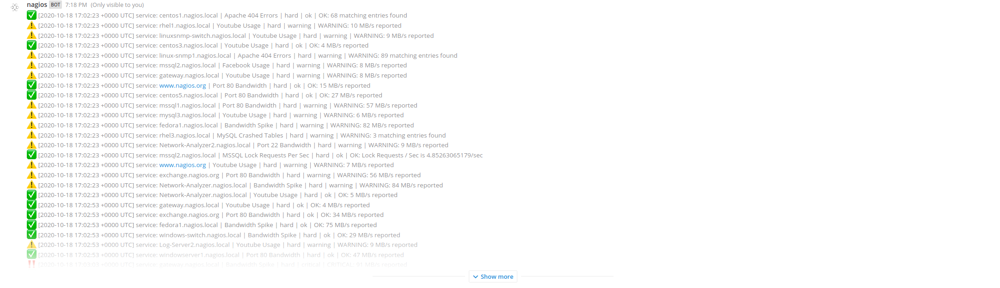
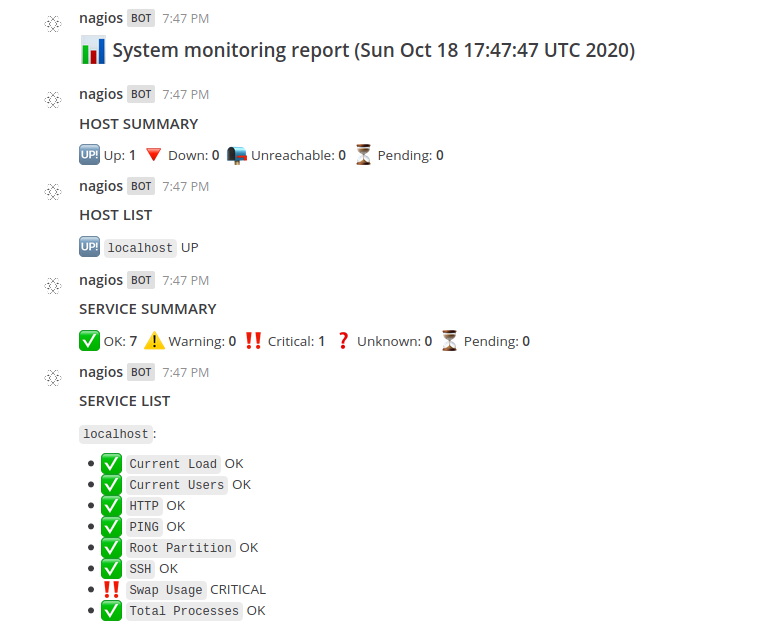
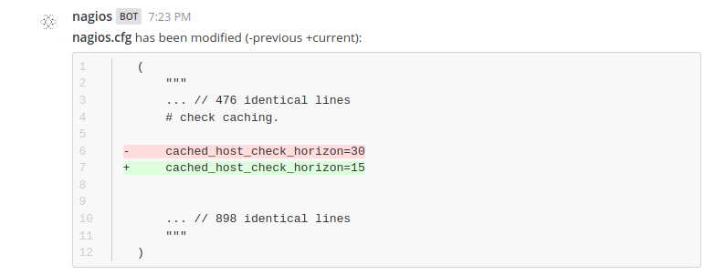

# Mattermost/Nagios Plugin

A Nagios plugin for Mattermost. Supports Nagios Core >= 4.4.x.

This plugin allows you to:

* Get logs from specific systems without leaving Mattermost.
* Get alerts and notifications resembling the `showlog.cgi` UI instantly delivered.
* Receive system monitoring reports on a subscribed channel.
* Be frequently informed which hosts and services have an abnormal state.
* Receive notifications about changes to the configuration on a subscribed channel.
* Receive a diff between the old and the new version anytime a change has been made to Nagios configuration.

### Getting logs

### Receiving system monitoring reports

### Receiving notifications about changes to the configuration

Ultimately, this will make you or your team more productive and make the experience with Nagios smoother.
